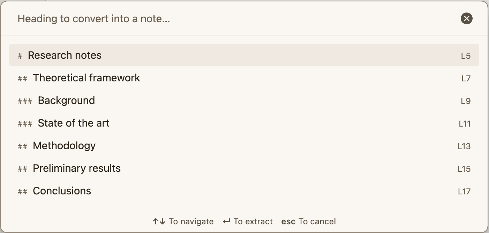

# Heading to Note

An [Obsidian](https://obsidian.md) plugin that takes a heading in your note and **moves** its whole
section — the heading plus every subsection under it — into a new note, then leaves a link where the
section used to be.



Built for a [Zettelkasten](https://en.wikipedia.org/wiki/Zettelkasten) / PKM workflow where a section
of a long note turns out to deserve a note of its own.

## Installation

### From the community plugin directory

1. In Obsidian, open **Settings → Community plugins → Browse**.
2. Search for **Heading to Note**, then **Install** and **Enable**.

### With BRAT (beta channel)

[BRAT](https://github.com/TfTHacker/obsidian42-brat) installs plugins that are not in the community
store, and keeps them updated from GitHub releases.

1. In Obsidian, open **Settings → Community plugins → Browse**.
2. Search for **BRAT** (`Obsidian42 - BRAT`), then **Install** and **Enable** it.
3. Open the command palette (`Ctrl/Cmd + P`) and run **`BRAT: Add a beta plugin for testing`**.
4. Paste this repository: `cjbarroso/obsidian-heading-to-note`
5. Click **Add Plugin**. BRAT downloads the latest release.
6. Go to **Settings → Community plugins** and enable **Heading to Note**.

BRAT only needs the repository name — no build step, no manual file copying.

### Manual installation

1. Download `main.js`, `manifest.json` and `styles.css` from the
   [latest release](https://github.com/cjbarroso/obsidian-heading-to-note/releases/latest).
2. Create the folder `<your-vault>/.obsidian/plugins/heading-to-note/` if it does not exist.
3. Put the three files inside that folder.
4. Reload Obsidian (**`Ctrl/Cmd + R`**, or quit and reopen).
5. Go to **Settings → Community plugins → Installed plugins** and enable **Heading to Note**.

If the plugin does not show up, check that **Restricted mode** is off and that the folder is named
exactly `heading-to-note` (the folder name must match the `id` in `manifest.json`).

### From source

There is no build step: `main.js` is plain CommonJS and loads directly.

```bash
git clone https://github.com/cjbarroso/obsidian-heading-to-note.git
cp main.js manifest.json styles.css "<your-vault>/.obsidian/plugins/heading-to-note/"
```

## Usage

Three ways to run it:

| Where | Command |
|---|---|
| Command palette | **Convert a heading into a new note** — opens a searchable list of every heading in the note |
| Command palette | **Convert the current section into a new note** — uses the heading that contains the cursor |
| Editor right click | **Convert section into a new note** |

## What it does

1. Finds the heading and its subtree: everything up to the next heading of the same or a higher
   level. Headings inside code fences and inside the frontmatter are ignored.
2. Creates the new note, named after the heading. If that name is taken, it appends ` 1`, ` 2`, …
3. Copies the frontmatter of the source note, minus the excluded properties.
4. Replaces the moved section in the source note with a link to the new note, and saves the file
   immediately instead of waiting for Obsidian's deferred autosave.
5. Rewrites links across the vault that pointed at the moved headings:
   `[[Source#Section]]` → `[[New note#Section]]`, keeping aliases and block references intact.

## Settings

**Settings → Heading to Note**

| Setting | Default | Description |
|---|---|---|
| Destination folder | *(empty)* | Empty means the folder of the source note. A path that does not exist is created. The field autocompletes the folders in the vault. |
| Open the new note | on | Opens the extracted note in a new tab. |
| Inherit frontmatter | on | Copies the source note's properties. |
| Excluded properties | `id, aliases` | Properties that are never copied (keeps a Zettelkasten `id` from being duplicated). |
| Keep the heading line | on | Off: the new note starts directly with the section body. |
| Leave a link | on | Off: the section disappears with no trace. |
| Link format | Wikilink | Or a callout: `> [!abstract] Extracted to [[New note]]`. |
| Update incoming links | on | Rewrites links elsewhere in the vault. |

## Languages

The interface follows the language configured in Obsidian: **English** by default, **Spanish** when
the app is in Spanish. The callout left behind in the source note uses the same language.

## Notes and limitations

- Editor only: if the note is in reading view, the commands are unavailable.
- Only Markdown files.
- Links inside the moved text that point to headings that stayed behind are not rewritten.

## License

[MIT](LICENSE)
